# 🏥 A VPN for Cloud Based Healthcare System

---
**Author:** Sahil Faraz | **Date:** April 2026

> **Academic Disclaimer:** This repository contains an academic project for the **Pearson B-TEC HND in Digital Technologies (Cybersecurity) - Unit 24: Applied Cryptography in the Cloud** module. It is strictly for portfolio and demonstration purposes. Other students may not use or copy this material for their own academic submissions.
---

## 📌 Project Overview
This project simulates a secure, cloud-hosted cryptographic infrastructure designed for a distributed healthcare network (Al-Shifa Hospital Network - ASHN). It demonstrates the practical application of advanced cryptographic techniques to secure sensitive **Patient Administration Data (PAD)**, **Patient Finance Data (PFD)**, and real-time **Patient Medical Data (PMD)** across a Virtual Private Network (VPN).

The architecture ensures **Confidentiality, Integrity, and Authentication** by combining hybrid cryptosystems, Public Key Infrastructure (PKI), and secure database hardening.

---

## 🚀 Core Features

*   🔐 **Stream & Block Ciphers:** Utilizes `ChaCha20` for low-latency, real-time medical data encryption (PMD) and `AES-GCM` for secure bulk storage of administrative and financial data (PAD/PFD).
*   📜 **Public Key Infrastructure (PKI):** Custom Certificate Authority (CA) implementation enforcing strict mutual TLS (mTLS) authentication between regional branches and the Central Data Hub.
*   🛡️ **Secure Transit (VPN):** OpenVPN implementation providing an AES-256-GCM encrypted tunnel for all data in transit.
*   🔍 **Data Integrity & Auditing:** SHA-256 hashing for tamper detection and comprehensive, automated audit logging for all encryption/decryption events.
*   ☁️ **Cloud Database Hardening:** Integration with MySQL, featuring role-based access control and encrypted payload ingestion.

---

## 🏗️ System Architecture & Security Case
### Encryption and Decyption Process
*  DEM Phase
  
   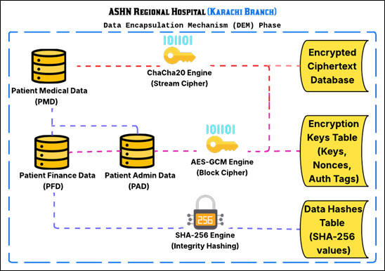
*  KEM & Authentication
   
   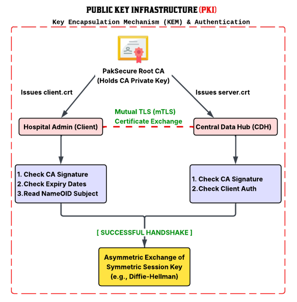
*  Secure VPN Tunnel
   
   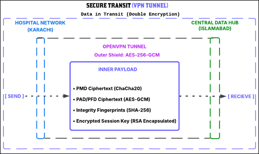
*  Data Decryption and Integrity Check
   
   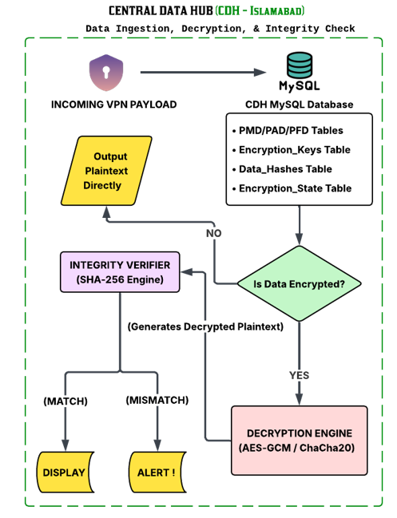
   
### Security Case Argument Map
  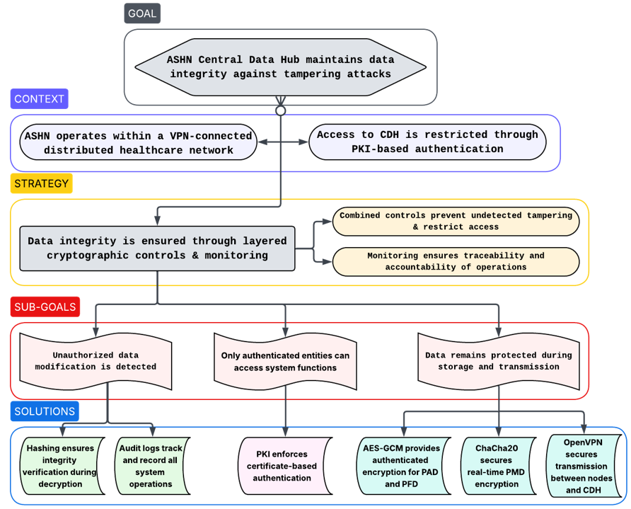

### 🔑 Cryptographic Strategy
1.  **Key Encapsulation Mechanism (KEM):** RSA-based public key encryption secures the exchange of session keys.
2.  **Data Encapsulation Mechanism (DEM):** Symmetric encryption (AES/ChaCha20) handles the heavy lifting of data payloads.
3.  **Provable Security:** Designed around IND-CCA (Indistinguishability under Chosen Ciphertext Attack) principles to resist adaptive threats.

---

## 📸 Implementation Showcase
### Welcome Screen
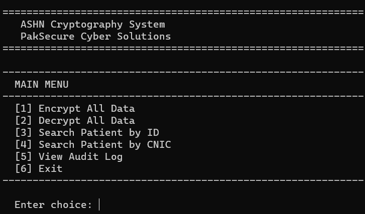

### Implemenation Phase
**CA Certificate Generation**

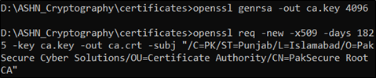

**Server Certificate Generation**
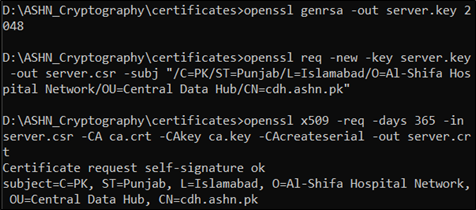

**Client Certificate Generation**
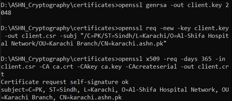
    
**OpenVPN Server & Tunnel**
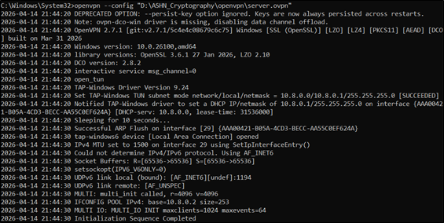
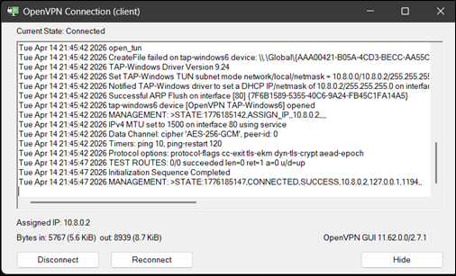
    
**MySQL Connection**
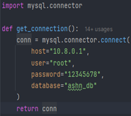

### Encryption Process (Option 1)

*   Certificate-Validation
    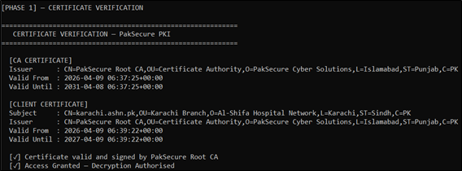
    
*   Encryption
    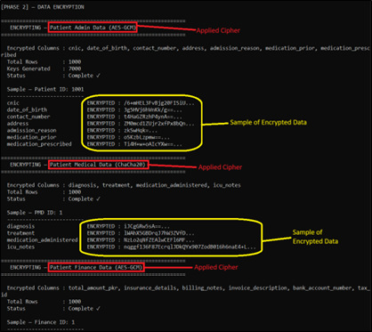
    
*   PAD, PFD and PMD after Encryption
    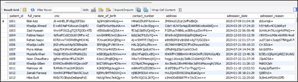
    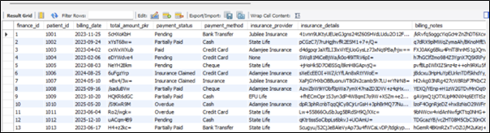
    

### Decryption Process (Option 2)
  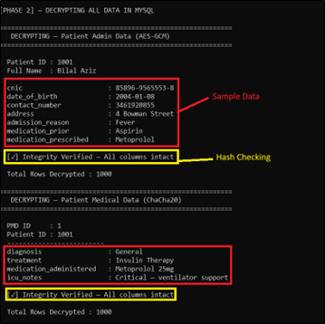
  
*   PAD, PFD and PMD after Decryption
    
    
    

### Log Table (Option 3)
  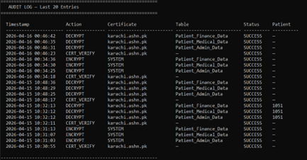

---

## 📂 Project Structure

A clean, modular architecture separating infrastructure, database interactions, and cryptographic engines.

    ASHN_Cloud_Cryptography/
    │
    ├── 📁 certificates/
    ├── 📁 config/
    │   ├── audit_log.py            
    │   ├── cert_config.py          
    │   ├── cert_verifier.py        
    │   └── db_config.py            
    │
    ├── 📁 database/                   
    │   ├── fetch_pad.py            
    │   ├── fetch_pfd.py            
    │   └── fetch_pmd.py            
    │
    ├── 📁 encryption/
    │   ├── aesgcm_encrypt.py
    │   ├── chacha20_encrypt.py
    │   └── hashing.py      
    │
    ├── 📁 MySQL/
    │   ├── ASHN_DB_Tables.sql      
    │   └── Mock_Data_CSVs/         
    │
    ├── 📁 openvpn/
    │   ├── client.ovpn             
    │   └── server.ovpn             
    │
    ├── 📄 requirements.txt            
    ├── ⚙️ main.py
    └── 📖 README.md

---
## ⚠️ Disclaimer
This repository represents an academic proof-of-concept for applying cryptographic controls to cloud-based systems. The included `.crt` files are for demonstration purposes only. Private keys (`.key`) and local environment files have been intentionally omitted from this public repository to maintain security best practices.
